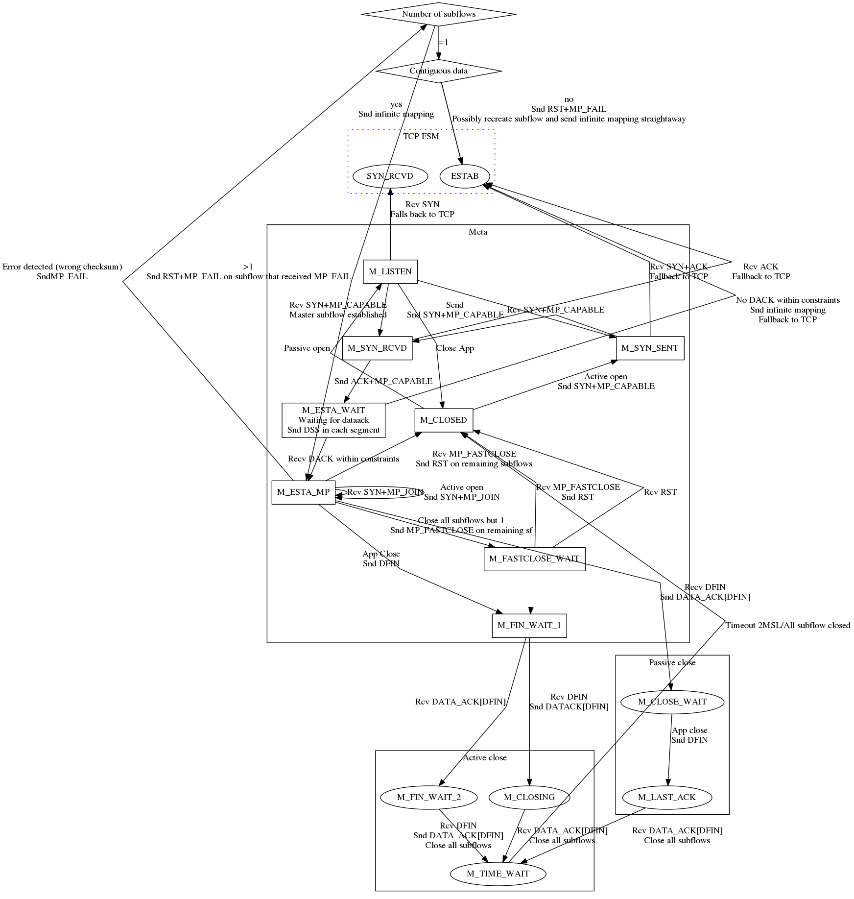

This repository (https://github.com/lip6-mptcp/specifications) hosts files used to generate the MPTCP meta machine picture as we understand it from the MPTCP specs.

We set out to generate such a picture to help us implement MPTCP in ns3.

Here is how it looks like as of January 2016:

If you believe we made any mistake, don't hesitate to send a pull request.

How to generate the above picture ?
===
1. You will need to install graphviz and git. On ubuntu/debian: `$ sudo apt-get install graphviz git`
2. Clone the repository `git clone https://github.com/lip6-mptcp/specifications.git ~/mptcp`
3. Move to the cloned folder and run `$ make`
4. It will generate a file named meta.png, which you can open with your image viewer. For instance you could try if xdg-utils package is installed `xdg-open meta.png`. 

The makefile also contains an svg target if you prefer.

